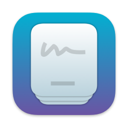

    

<h1 align="center">Swift Mind</h1>
<h4 align="center">A Simple flash cards app for iOS and macOS</h4>

### License 📝

Licensed under the [GNU GENERAL PUBLIC LICENSE Version 3](https://github.com/Rminsh/Cards/blob/main/LICENSE.md).
